# Export Traceability User Manual

## General

The purpose of this document is to describe the production of a traceability matrix generated for a requirements system, using the Doors script Para Export Traceability. Para Export Traceability produces a rich text file, which can be opened with MS Word or a similar application. This document targets requirements engineers, who are writing requirements specifications and have to export module traceability matrixes, Doors administrators, who have to produce a system-wide traceability matrix, and readers of the traceability matrix.

Para Export Traceability can be launched from the menu Common \(d\) -&gt; Document/Report Generation -&gt; Generate Traceability Matrix Document.

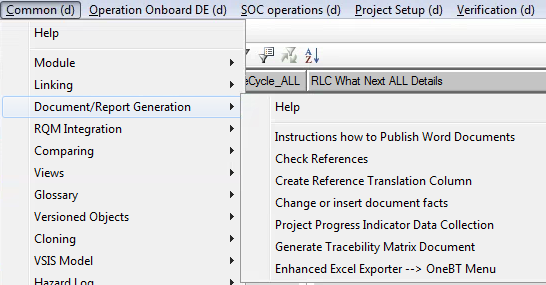

### Definitions

| Actual Traceability Matrix | The part of the generated traceability matrix which is only concerned with traceability. |
| :--- | :--- |
| Attribute | A Doors attribute. Including, for example, Object Identifier, Object Number, Object Text, or user-defined attributes… |
| Base Module | The module for which the module traceability matrix is created. |
| Base Object | An object in the base module. |
| Base System | The requirements system for which a system traceability matrix is generated. |
| Involved Modules | All Doors modules that are linked to the module within the defined levels and conditions, for which the module traceability matrix is produced. |
| Module | A Doors module, which can be a requirements specification, a test specification, or a test record. |
| Module Traceability Matrix | The traceability matrix for a requirements module. |
| Object | A Doors object. |
| Requirements System | The sum of all requirements specifications for a product, including test specifications and test records. |
| System Traceability Matrix | The complete traceability matrix for a requirements system. |
| System Traceability Overview | An umbrella document combining all module traceability matrixes and descriptions. |
| Traceability Export | The part of a Module Traceability Matrix, which is generated by the script Para Export Traceability. |

### Requirements System Traceability

A requirements system includes all modules of a project, starting from the customer requirements down to the test records. All relevant modules should be frozen in a baseline set before the traceability matrix is generated. The complete traceability matrix consists out of this document, the system traceability overview document, and separate module traceability matrixes for each requirements module.

#### Export Traceability User Manual

This document explains how the whole system works together, how the traceability matrixes should be read, and how they are generated.

#### System Traceability Overview

The system traceability overview document contains a reference to this document, references to all involved module traceability matrixes, a module structure overview drawings, and product specific information concerning the module traceability matrixes.

#### Module Traceability Matrixes

A separate module traceability matrix is generated for each requirements module. A module traceability matrix consists out a short introduction and the generated traceability export from Para Export Traceability.

## Traceability Export Explanation

This section explains how the traceability export should be read and the different options that can be used when exporting the module traceability matrixes. How to produce the traceability export can be found in the section Traceability Export Generation.

The result can look similar the following example, which should be read from right to left and top to bottom so that the bottom table borders of the previous page match the top table borders of the next page. The output consists of several sections which are Involved Modules, Exported Attributes, the Actual Traceability Matrix, and a Summary.

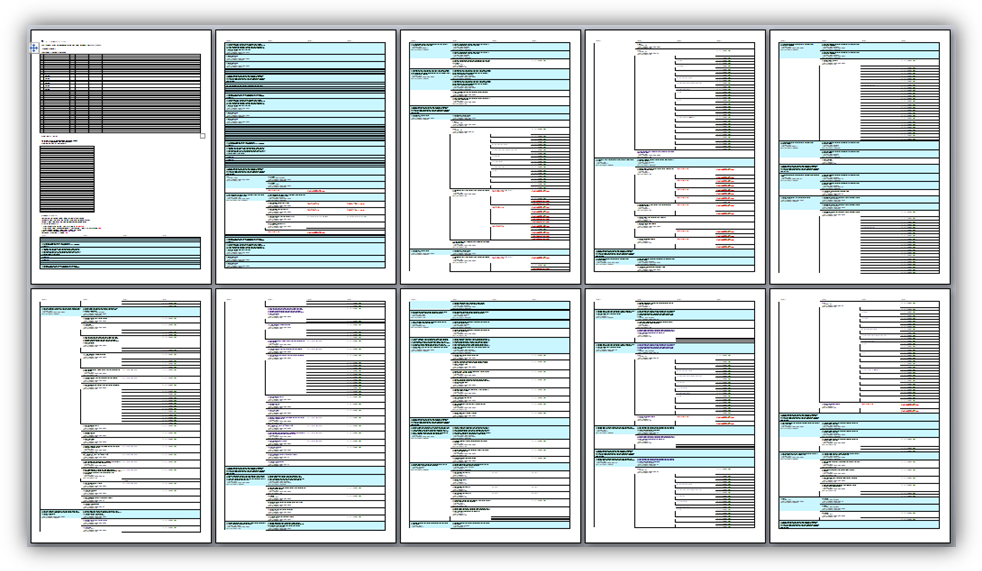

Note: In the following examples all object texts and object headings have been replaced by a placeholder, i.e. all letters have been replaced with Xs and all numbers with 9s.

### Involved Modules

This section gives a summary of the modules involved in the generated module traceability matrix.

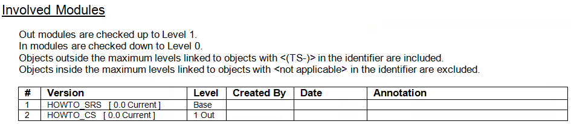

The information in the columns Created By, Date and Annotation is only used if baselines are involved in the module traceability matrix. Created By is the Doors username of the baseline creator. The date is the baseline creation date. Annotation is the comment the baseline creator has filled in when creating the baseline. For current versions, the last three columns are empty.

Which modules are involved is defined by which modules are linked to the base module within the levels of the out direction, the levels of the in direction, and which modules fulfill the conditions to be included outside the defined levels. Modules inside the defined levels can be excluded according to certain module name criteria.

### Exported Attributes

This section shows which attributes are included in the involved modules including a short summary. If an attribute is shown in the traceability matrix it is written in black. If an attribute is not shown, it is written in gray.

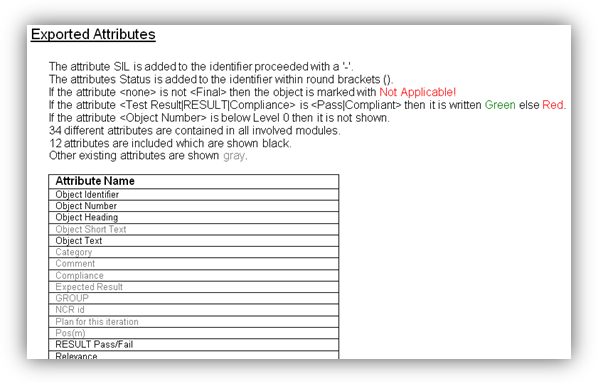

Note: If the levels of the involved modules are reduced, also the attributes of the now excluded modules are still listed if the involved modules are not reloaded.

The attributes listed consist of special attributes, standard attributes, and user-defined attributes.

Special attributes are the Object Identifier and the Object Number. The Object Identifier is a combination of the Module Prefix and the Absolute Number. The Object Number is only shown if the Object Heading is not empty.

Standard attributes are the Object Heading, the Object Short Text, and the Object Text.

User-defined attributes include any attributes defined by the users. They are listed below the Object Text attribute in alphabetical order.

### Actual Traceability Matrix

The actual traceability matrix is the part, which shows the actual linking of the objects followed by a short introduction. The summary contains the settings according to which the actual traceability matrix has been produced.

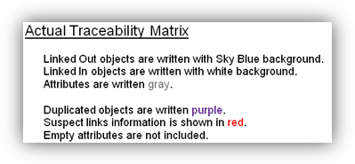

The Traced Requirement figure shows how a traced requirement can look like. The actual output depends on the requirements structure and the settings used to generate the module traceability matrix.

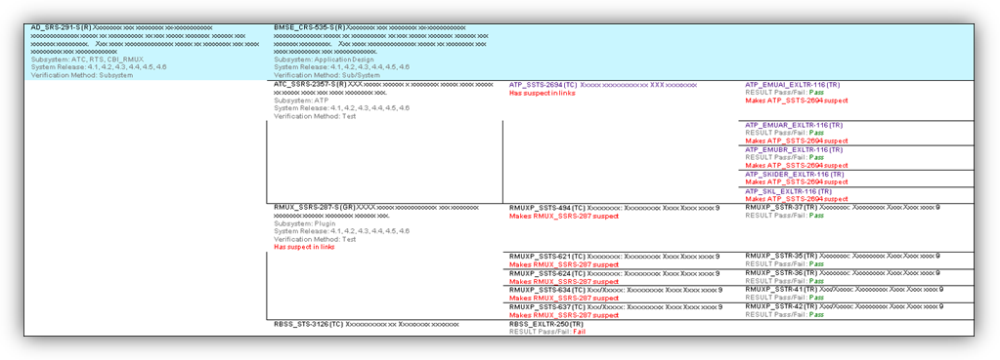

#### Levels

The Level 0 column contains the base objects of the base module, from where the traceability export is generated. Level 1 means one level above or one level below, Level 2 means two levels above or two levels below, and so on. The maximum distance, which a linked object can be away from the base object, is 9 levels. The actual number of levels, shown in the traceability matrix, depends on if a level contains information or not. Empty level columns are automatically excluded.

#### Table Borders

The table borders are generated to make it easier to follow links. If there are two objects in neighboring levels, which can be connected with a more or less straight line without hitting a table border, it means that they are linked.

#### Background Color

Linked objects in the Out \(normally up\) direction are shown with sky blue background, if also In linked objects are included in the export. Linked objects in the In direction are shown with a white background.

#### Excluded Objects

Table cells or deleted objects in the base module are not included in the traceability matrix. Pictures or OLE objects in any module are not included in the traceability matrix.

#### Object Identifier

The object identifiers consist out of the module prefix followed by the Absolute Number. Two other attributes can be combined with the object identifier. The first attribute is separated with a ‘-‘ and the second attribute is separated with ‘ \(‘ and terminated with ‘\)’.

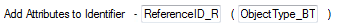

For example “ATC\_SSRS-2391-S \(R\)” consists out of the Module Prefix “ATC\_SSRS-“, the Absolute Number “2391”, the safety requirement indication “-S”, and the object type “\(R\)”. That means that this object is a safety requirement with the number 2391 in the ATC subsystem requirements specification.

Object identifications are written bold. Object identifications are written black, but when the object is shown a second time they can be written violet.

#### Object Headings

The object headings consist out of the heading number \(Object Number attribute\) and the heading text \(Object Heading attribute\).

Headings are written bold. Object headings are written black, but when the object is shown a second time they can be written violet.

#### Object Text

The object text is the Object Text attribute and it is written in normal font. Object text is written black, but when the object is shown a second time it can be written violet.

#### Other Attributes

Other attributes are written in gray color. The attribute name followed by a ‘:’ is written bold. The attribute value is written in normal font. Attribute values are written gray but can be written in color if their value matches certain criteria.

If an attribute value contains a line break, it is replaced by a comma followed by a space “, “.

Attributes with empty values are not shown in the traceability export but can be if this is wanted.

#### Colored Attribute Values

Special attributes, like the test result, can, for example, be written green when passed and red when failed.

#### Not Applicable Objects

Objects can be marked as “Not Applicable!”. This means they are part of the requirements system, but not applicable to this particular release.

#### Hidden Attributes

Attributes can be hidden below a certain level. The purpose of this function is to show that the traceability continues but to hide confidential information.

#### Duplicated Objects

Duplicated objects, which are shown already above in the module traceability matrix, can be written violet. That should save some time when reviewing the module traceability matrix, since objects linked after the duplicated object, do not have to be checked twice.

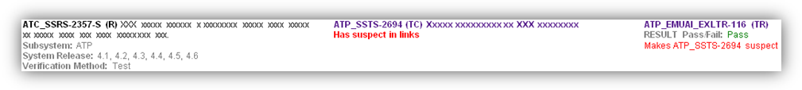

#### Suspect Links

The two objects, shown in the figure Suspect Links with a red comment, indicate a suspect link between them. The comment “Has suspect out/in links” means that a link out of or into this object is suspect and that the linked objects should be check if they are still valid. The comment “Makes \[Object Identifier\] suspect” means that a change in this object has been made later than in the linked object.

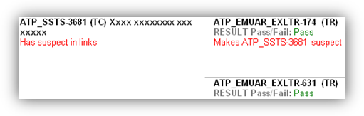

Note: Suspect links are only shown in the direction towards the base object.

#### Combined Last Objects

To reduce the file size and increase the overview, objects in the most left filled-in column can be combined in a single table row.

#### Real Headings

Real Headings can be shown without attributes so that they look like headings in a document and are included in the Navigation Pane. If the Real Headings option is selected the traceability table is split into smaller tables.

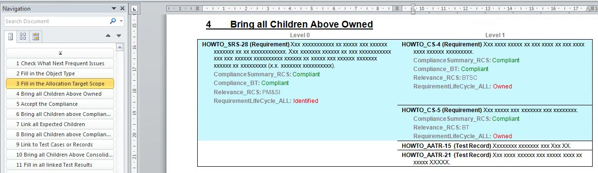

### Summary

At the end of the traceability matrix, a short summary is shown.

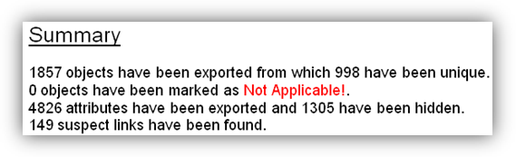

## Traceability Export Generation

The traceability export is generated in rich text format and can be opened in MS Word.

The main functions of Para Word export are…

* Generate traceability matrixes for a complete system.
* Generate traceability matrixes for single modules.
* Trace out-links and in-links up to 9 levels.
* Make table borders according to links.
* Show suspect links.
* Include all attributes or only selected ones.
* Select attributes according to a regular expression.
* Mark objects as duplicated.
* Mark objects as Not Applicable!
* Color attributes according to their values.
* Show information about all involved modules.
* Show information about the involved attributes.
* Handle modules in a baseline set.
* Exclude module according to a regular expression.
* Split the traceability table according to headings.
* Produce a rich text file.
* Select paper size, paper orientation, font size, and indent.

### Starting Para Export Traceability

When Para Export Traceability is launched previous settings are restored from the registry. Then all the involved modules are loaded into memory, what can take some time. During the involved modules are loaded, the Attributes to Export list is populated. After all modules are loaded, the attributes are selected according to the attributes selection regular expression.

The Para Export Traceability user interface looks as shown below.

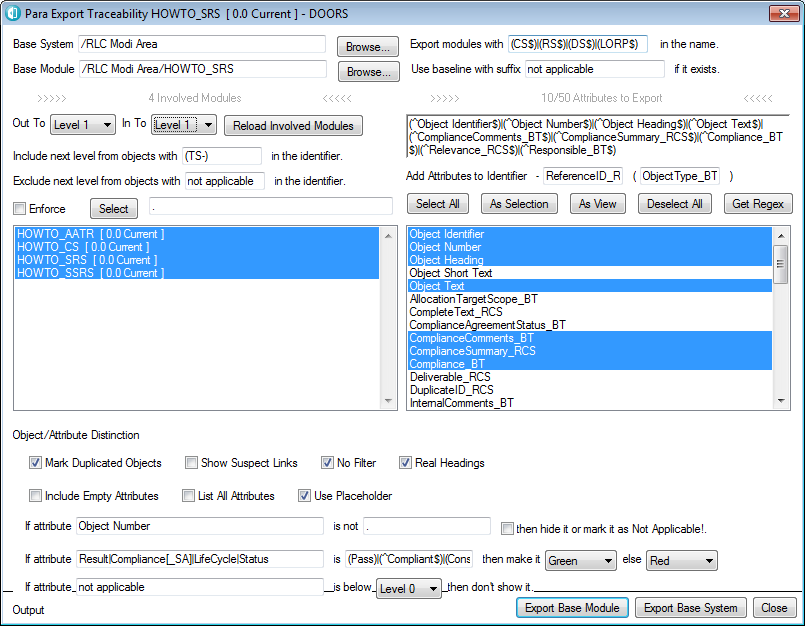

### Base System/Module Selection

By selecting the base system all modules, which fulfill the naming conventions, can be exported to the selected output path in one go. Click on Browse… to select a new base project. If a specific baseline should be loaded it the baseline suffix has to be written in the according field.

By selecting the base module only the selected module can be exported. Click Browse… to change the selected module. Click on Reload Involved Module to update the involved modules and Attributes to Export according to the selected base module.

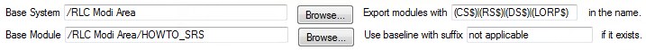

### Involved Modules

The involved modules are loaded when Para Export Traceability is launched, when an export is made, the involved module's settings have been changed, or when the Reload Involved Modules button is pressed.

Note: To detect a change in the Include/Exclude Next Level… regular expression, the Enter button has to be pressed after the input.

Note: The number shown over the Involved Modules list indicates how many modules are involved after the list has been refreshed.

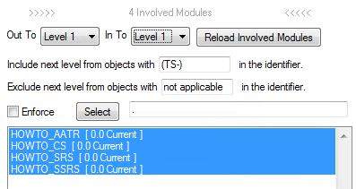

The levels of involved modules can be selected individually for the out and in direction. Out To defines how many levels of objects, that are linked out, are traced. In To defines how many levels of objects, which are linked in, are traced. If Level 0 is select nothing is traced in that direction.

To include linked objects outside the level limits, fill in the regular expression with a part of the identifier. In this case “TS-“ is used as part of all test specifications module prefixes. That means any objects below the test specification, i.e. the test records, are included. If no objects outside the level limits should be included, fill in anything that is not part of an identifier, for example, “not applicable”.

To exclude a linked object within the level limits, fill in the regular expression with a part of the identifier. In this case “not applicable“ is used and all objects are included. If no objects inside the level limits should be excluded, fill in anything that is not part of an identifier, for example, “not applicable”.

If Enforce is ticked, the modules are selected according to the regular expression to the right. Which modules are selected can be seen when clicking Select. A dot “.” means all modules.

Note: So far all modules are involved all the time and it is not possible to manually exclude single modules by clicking on them if they are within the level borders.

### Attributes to Export

The Attributes to Export list shows all attributes contained in all loaded modules since the last time the modules have been reloaded.

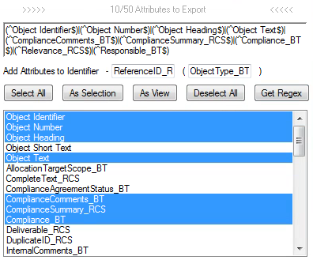

To add attributes to the identifier, write the names in the Add Attributes to Identifier fields. If the first attribute value exists it is added to the identifier separated with a ‘-‘ in between. If the second attribute value exists it is added at the end of the identifier in brackets. If attributes are added to the identifier, they should be deselected in the Attributes to Export list, so that they are not exported twice.

Attributes, which should be included in the traceability export, can be selected or deselected individually, by clicking on them. To select or deselect all attributes in the list, just click on Select All or Deselect All. If the attributes in the current view of the base module should be selected, click on As View. As Selection selects the attributes listed in the Attribute Selection regular expression.

Note: The Attribute Selection will be set for each base module when a base system is exported.

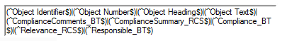

Clicking on Get Regex sets the Attribute Selection regular expression according to the selected attributes in the Attributes to Export list.

### Object/Attribute Distinction

Objects and attributes can be made different from the rest according to certain criteria.

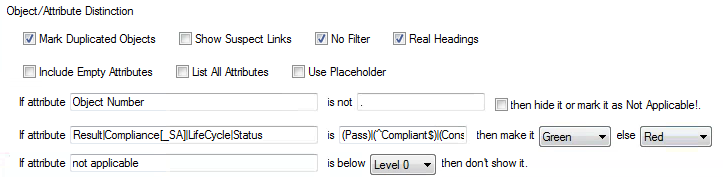

Check Mark Duplicated Objects to highlight objects that are written more than once violet.

Check Show Suspect Links to show which objects are made suspect by which objects.

Check No Filter to disable filtering before the traceability export is generated.

Check Include Empty Attributes to include the title of attributes with no values in the export.

Check List All Attributes to show all attribute contained in all involved modules in the attributes list. Not exported attributes are written in grey.

Check Use Placeholder to replace the actual Object Heading and the Object Text with placeholders.

Not Applicable! can be added to any object if the values of its attributes don’t fulfill the regular expression.

The values of attributes can be colored if the values fulfill certain criteria.

Attributes can be omitted if they are below a certain level.

All the text fields are regular expressions. One statement can be used for more than one Attribute and for more than one attribute value. For example, “Test Result\|RESULT\|Compliance” is valid for the attributes Test Result, RESULT Pass/Fail, and Compliance. “Pass\|Compliant” means if one of these attributes is Pass, Passed, or Compliant, it will be colored green, otherwise red.

### Output

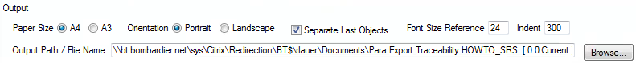

Select the Paper Size and Paper Orientation.

Check Separate Last Objects is checked to make separate table row for each object.

Change the Font Size to make all fonts larger or smaller.

Change the Indent to indent everything written below the first line with the Object Identification in an exported object.

Set the Output Path / File Name to the path and file name to where the traceability matrix should be exported. Click on Browse… to change the path and file name, or edit it in the Output Path / File Name field.

### Export Traceability Matrix

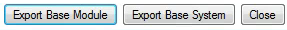

Click on Export Base Module to export only the base module.

Click on Export Base System to export all involved modules, which fulfill the naming conventions, to the selected output path in one go. The file name for each module traceability matrix export is changed according to the module name.

Click on Close to close Para Export Traceability.

## Traceability Set Generation

A traceability set contains the Para Export Traceability User Manual, the Traceability System Overview, and the Module Traceability Matrixes.

### Traceability System Overview

Fill in the front page and the history. Update references and the module overview drawing.

### Module Traceability Matrix

The file name of a module traceability matrix is a combination of the Project abbreviation, MTM, and the Doors module name, for example, BSP MTM AD\_SRS for Bangkok Skytrain Projects Module Traceability Matrix Application Design System Requirements Specification.

Fill in the front page and the history. The module name on the front page is a combination of the Doors modules name, the Doors Version and the Doors baseline suffix or the word Current, for example, AD\_SRS 3.1 \(BPS RS 2011-06-01\).

The recommended settings for a requirements module are 1 level out and 1 level in with the next level module objects included for test cases. The SIL and the Status attribute should be added to the Identifier. Duplicated objects should be marked and suspect links shown. Passed test results should be colored green and failed ones red. The object number should not be shown for levels below zero. The paper format should be Portrait A4. The objects should not be separated. The reference font size should be 18 and the indent 100.

After the export, open the Para Traceability Export for each module with Word Pad and use copy and paste to transfer the complete content in the last Paragraph of the Para Export Traceability Module Template.

