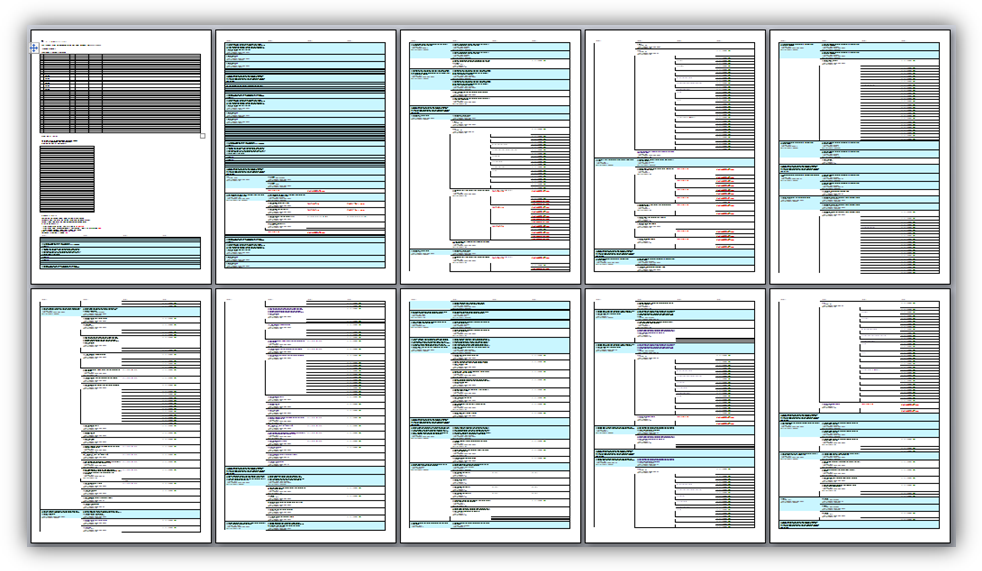
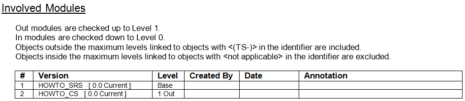
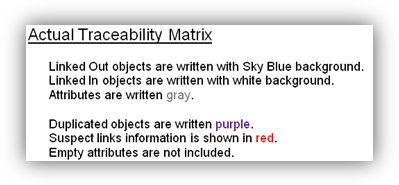
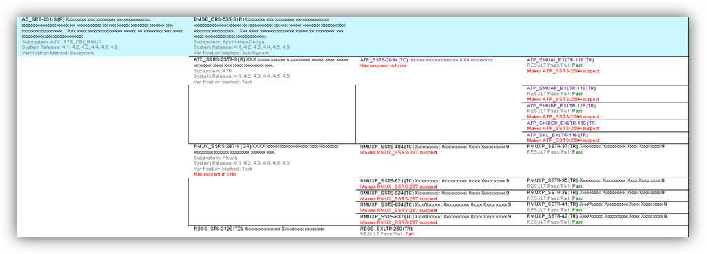
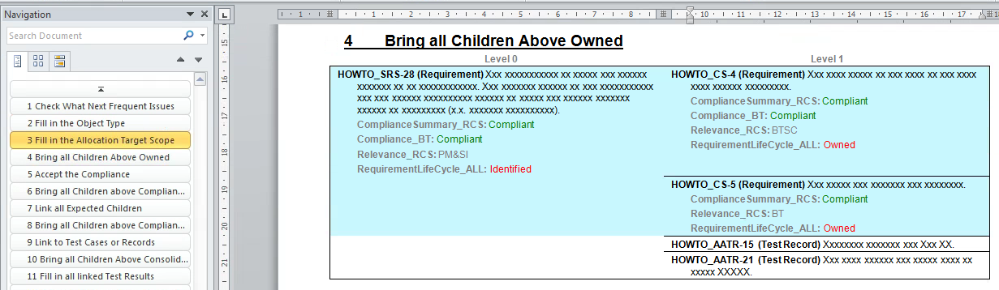
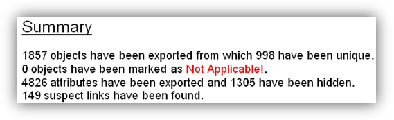

# Traceability Export Explanation

### Traceability Export Explanation

This section explains how the traceability export should be read and the different options that can be used when exporting the module traceability matrixes. How to produce the traceability export can be found in the section Traceability Export Generation.

The result can look similar the following example, which should be read from right to left and top to bottom so that the bottom table borders of the previous page match the top table borders of the next page. The output consists of several sections which are Involved Modules, Exported Attributes, the Actual Traceability Matrix, and a Summary.

Note: In the following examples all object texts and object headings have been replaced by a placeholder, i.e. all letters have been replaced with Xs and all numbers with 9s.

#### Involved Modules

This section gives a summary of the modules involved in the generated module traceability matrix.

The information in the columns Created By, Date and Annotation is only used if baselines are involved in the module traceability matrix. Created By is the Doors username of the baseline creator. The date is the baseline creation date. Annotation is the comment the baseline creator has filled in when creating the baseline. For current versions, the last three columns are empty.

Which modules are involved is defined by which modules are linked to the base module within the levels of the out direction, the levels of the in direction, and which modules fulfill the conditions to be included outside the defined levels. Modules inside the defined levels can be excluded according to certain module name criteria.

#### Exported Attributes

This section shows which attributes are included in the involved modules including a short summary. If an attribute is shown in the traceability matrix it is written in black. If an attribute is not shown, it is written in gray.

Note: If the levels of the involved modules are reduced, also the attributes of the now excluded modules are still listed if the involved modules are not reloaded.

The attributes listed consist of special attributes, standard attributes, and user-defined attributes.

Special attributes are the Object Identifier and the Object Number. The Object Identifier is a combination of the Module Prefix and the Absolute Number. The Object Number is only shown if the Object Heading is not empty.

Standard attributes are the Object Heading, the Object Short Text, and the Object Text.

User-defined attributes include any attributes defined by the users. They are listed below the Object Text attribute in alphabetical order.

#### Actual Traceability Matrix

The actual traceability matrix is the part, which shows the actual linking of the objects followed by a short introduction. The summary contains the settings according to which the actual traceability matrix has been produced.

The Traced Requirement figure shows how a traced requirement can look like. The actual output depends on the requirements structure and the settings used to generate the module traceability matrix.

**Levels**

The Level 0 column contains the base objects of the base module, from where the traceability export is generated. Level 1 means one level above or one level below, Level 2 means two levels above or two levels below, and so on. The maximum distance, which a linked object can be away from the base object, is 9 levels. The actual number of levels, shown in the traceability matrix, depends on if a level contains information or not. Empty level columns are automatically excluded.

**Table Borders**

The table borders are generated to make it easier to follow links. If there are two objects in neighboring levels, which can be connected with a more or less straight line without hitting a table border, it means that they are linked.

**Background Color**

Linked objects in the Out \(normally up\) direction are shown with sky blue background, if also In linked objects are included in the export. Linked objects in the In direction are shown with a white background.

**Excluded Objects**

Table cells or deleted objects in the base module are not included in the traceability matrix. Pictures or OLE objects in any module are not included in the traceability matrix.

**Object Identifier**

The object identifiers consist out of the module prefix followed by the Absolute Number. Two other attributes can be combined with the object identifier. The first attribute is separated with a ‘-‘ and the second attribute is separated with ‘ \(‘ and terminated with ‘\)’.

For example “ATC\_SSRS-2391-S \(R\)” consists out of the Module Prefix “ATC\_SSRS-“, the Absolute Number “2391”, the safety requirement indication “-S”, and the object type “\(R\)”. That means that this object is a safety requirement with the number 2391 in the ATC subsystem requirements specification.

Object identifications are written bold. Object identifications are written black, but when the object is shown a second time they can be written violet.

**Object Headings**

The object headings consist out of the heading number \(Object Number attribute\) and the heading text \(Object Heading attribute\).

Headings are written bold. Object headings are written black, but when the object is shown a second time they can be written violet.

**Object Text**

The object text is the Object Text attribute and it is written in normal font. Object text is written black, but when the object is shown a second time it can be written violet.

**Other Attributes**

Other attributes are written in gray color. The attribute name followed by a ‘:’ is written bold. The attribute value is written in normal font. Attribute values are written gray but can be written in color if their value matches certain criteria.

If an attribute value contains a line break, it is replaced by a comma followed by a space “, “.

Attributes with empty values are not shown in the traceability export but can be if this is wanted.

**Colored Attribute Values**

Special attributes, like the test result, can, for example, be written green when passed and red when failed.

**Not Applicable Objects**

Objects can be marked as “Not Applicable!”. This means they are part of the requirements system, but not applicable to this particular release.

**Hidden Attributes**

Attributes can be hidden below a certain level. The purpose of this function is to show that the traceability continues but to hide confidential information.

**Duplicated Objects**

Duplicated objects, which are shown already above in the module traceability matrix, can be written violet. That should save some time when reviewing the module traceability matrix, since objects linked after the duplicated object, do not have to be checked twice.

**Suspect Links**

The two objects, shown in the figure Suspect Links with a red comment, indicate a suspect link between them. The comment “Has suspect out/in links” means that a link out of or into this object is suspect and that the linked objects should be check if they are still valid. The comment “Makes \[Object Identifier\] suspect” means that a change in this object has been made later than in the linked object.

Note: Suspect links are only shown in the direction towards the base object.

**Combined Last Objects**

To reduce the file size and increase the overview, objects in the most left filled-in column can be combined in a single table row.

**Real Headings**

Real Headings can be shown without attributes so that they look like headings in a document and are included in the Navigation Pane. If the Real Headings option is selected the traceability table is split into smaller tables.

#### Summary

At the end of the traceability matrix, a short summary is shown.

