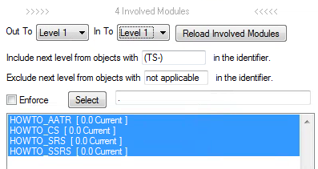
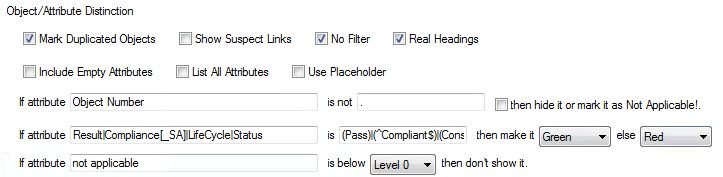
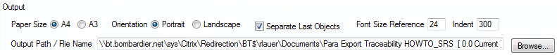
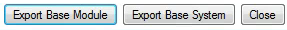

# Traceability Export Generation

The traceability export is generated in rich text format and can be opened in MS Word.

The main functions of Para Word export are…

* Generate traceability matrixes for a complete system.
* Generate traceability matrixes for single modules.
* Trace out-links and in-links up to 9 levels.
* Make table borders according to links.
* Show suspect links.
* Include all attributes or only selected ones.
* Select attributes according to a regular expression.
* Mark objects as duplicated.
* Mark objects as Not Applicable!
* Color attributes according to their values.
* Show information about all involved modules.
* Show information about the involved attributes.
* Handle modules in a baseline set.
* Exclude module according to a regular expression.
* Split the traceability table according to headings.
* Produce a rich text file.
* Select paper size, paper orientation, font size, and indent.

## Starting Para Export Traceability

When Para Export Traceability is launched previous settings are restored from the registry. Then all the involved modules are loaded into memory, what can take some time. During the involved modules are loaded, the Attributes to Export list is populated. After all modules are loaded, the attributes are selected according to the attributes selection regular expression.

The Para Export Traceability user interface looks as shown below.

## Base System/Module Selection

By selecting the base system all modules, which fulfill the naming conventions, can be exported to the selected output path in one go. Click on Browse… to select a new base project. If a specific baseline should be loaded it the baseline suffix has to be written in the according field.

By selecting the base module only the selected module can be exported. Click Browse… to change the selected module. Click on Reload Involved Module to update the involved modules and Attributes to Export according to the selected base module.

## Involved Modules

The involved modules are loaded when Para Export Traceability is launched, when an export is made, the involved module's settings have been changed, or when the Reload Involved Modules button is pressed.

Note: To detect a change in the Include/Exclude Next Level… regular expression, the Enter button has to be pressed after the input.

Note: The number shown over the Involved Modules list indicates how many modules are involved after the list has been refreshed.

The levels of involved modules can be selected individually for the out and in direction. Out To defines how many levels of objects, that are linked out, are traced. In To defines how many levels of objects, which are linked in, are traced. If Level 0 is select nothing is traced in that direction.

To include linked objects outside the level limits, fill in the regular expression with a part of the identifier. In this case “TS-“ is used as part of all test specifications module prefixes. That means any objects below the test specification, i.e. the test records, are included. If no objects outside the level limits should be included, fill in anything that is not part of an identifier, for example, “not applicable”.

To exclude a linked object within the level limits, fill in the regular expression with a part of the identifier. In this case “not applicable“ is used and all objects are included. If no objects inside the level limits should be excluded, fill in anything that is not part of an identifier, for example, “not applicable”.

If Enforce is ticked, the modules are selected according to the regular expression to the right. Which modules are selected can be seen when clicking Select. A dot “.” means all modules.

Note: So far all modules are involved all the time and it is not possible to manually exclude single modules by clicking on them if they are within the level borders.

## Attributes to Export

The Attributes to Export list shows all attributes contained in all loaded modules since the last time the modules have been reloaded.

To add attributes to the identifier, write the names in the Add Attributes to Identifier fields. If the first attribute value exists it is added to the identifier separated with a ‘-‘ in between. If the second attribute value exists it is added at the end of the identifier in brackets. If attributes are added to the identifier, they should be deselected in the Attributes to Export list, so that they are not exported twice.

Attributes, which should be included in the traceability export, can be selected or deselected individually, by clicking on them. To select or deselect all attributes in the list, just click on Select All or Deselect All. If the attributes in the current view of the base module should be selected, click on As View. As Selection selects the attributes listed in the Attribute Selection regular expression.

Note: The Attribute Selection will be set for each base module when a base system is exported.

Clicking on Get Regex sets the Attribute Selection regular expression according to the selected attributes in the Attributes to Export list.

## Object/Attribute Distinction

Objects and attributes can be made different from the rest according to certain criteria.

Check Mark Duplicated Objects to highlight objects that are written more than once violet.

Check Show Suspect Links to show which objects are made suspect by which objects.

Check No Filter to disable filtering before the traceability export is generated.

Check Include Empty Attributes to include the title of attributes with no values in the export.

Check List All Attributes to show all attribute contained in all involved modules in the attributes list. Not exported attributes are written in grey.

Check Use Placeholder to replace the actual Object Heading and the Object Text with placeholders.

Not Applicable! can be added to any object if the values of its attributes don’t fulfill the regular expression.

The values of attributes can be colored if the values fulfill certain criteria.

Attributes can be omitted if they are below a certain level.

All the text fields are regular expressions. One statement can be used for more than one Attribute and for more than one attribute value. For example, “Test Result|RESULT|Compliance” is valid for the attributes Test Result, RESULT Pass/Fail, and Compliance. “Pass|Compliant” means if one of these attributes is Pass, Passed, or Compliant, it will be colored green, otherwise red.

## Output

Select the Paper Size and Paper Orientation.

Check Separate Last Objects is checked to make separate table row for each object.

Change the Font Size to make all fonts larger or smaller.

Change the Indent to indent everything written below the first line with the Object Identification in an exported object.

Set the Output Path / File Name to the path and file name to where the traceability matrix should be exported. Click on Browse… to change the path and file name, or edit it in the Output Path / File Name field.

## Export Traceability Matrix

Click on Export Base Module to export only the base module.

Click on Export Base System to export all involved modules, which fulfill the naming conventions, to the selected output path in one go. The file name for each module traceability matrix export is changed according to the module name.

Click on Close to close Para Export Traceability.
